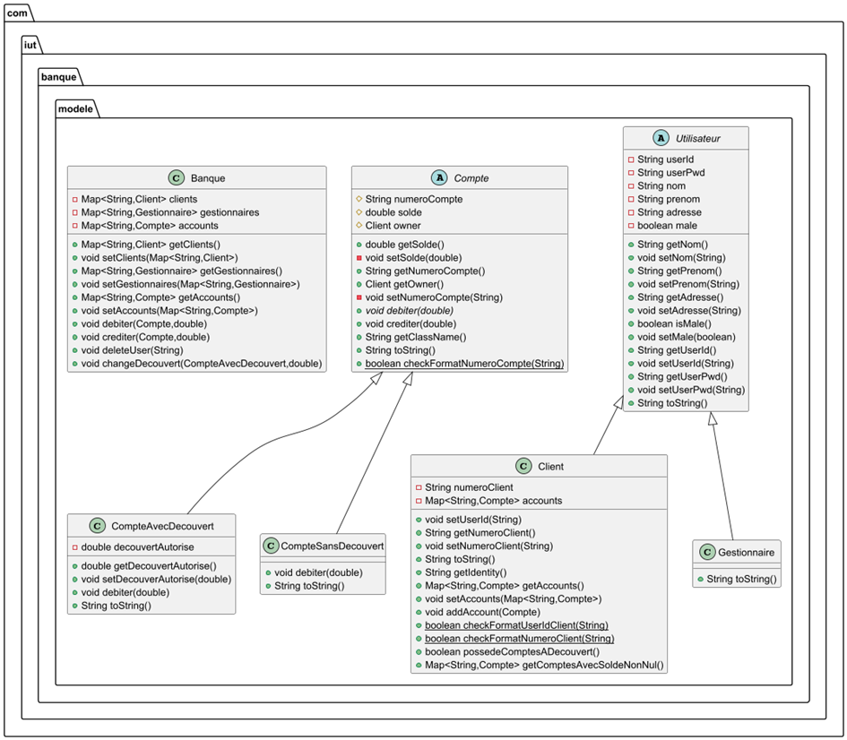

# BUT3_QUAL_DEV_Groupe14

# ASBank2025 - Application Bancaire IUT

[](https://www.java.com)
[](https://www.jetbrains.com/idea/)
[](https://tomcat.apache.org/)
[](https://www.mysql.com/)

## 📋 Description

Application bancaire développée dans le cadre du BUT3 Informatique - Module R5.A.08 Qualité Dev. 
Cette application web permet la gestion complète des opérations bancaires avec une architecture Java EE.

**Développé par :** Alexandre Kesseler, Amer AIT CHIKHOUNE  
**Formation :** BUT3 QUAL_DEV_Groupe1  
**Année :** 2025

## 🚀 Fonctionnalités

- ✅ Gestion des comptes bancaires
- ✅ Opérations de transactions
- ✅ Interface web responsive
- ✅ Tests unitaires avec JUnit
- ✅ Architecture MVC avec Hibernate
- ✅ Sécurité des données

## 📦 Prérequis

### Configuration minimale
- **OS :** Windows 10/11, macOS 10.14+, ou Linux Ubuntu 20.04+
- **RAM :** 8 GB minimum (16 GB recommandé)
- **Espace disque :** 10 GB libre
- **Java JDK :** Version 11 
- **Connexion Internet :** Requise pour le téléchargement des dépendances

### Logiciels requis
| Logiciel | Version | Lien de téléchargement |
|----------|---------|------------------------|
| IntelliJ IDEA Ultimate | 2025.2.1 | [Télécharger](https://www.jetbrains.com/fr-fr/idea/) |
| Apache Tomcat | 9.0.109 | [Télécharger](https://tomcat.apache.org/) |
| MySQL Server | 8.0+ | [Télécharger](https://dev.mysql.com/downloads/mysql/) |
| MySQL Workbench | 8.0.43 | [Télécharger](https://dev.mysql.com/downloads/workbench/) |

## 🛠️ Installation

### 1️⃣ Installation d'IntelliJ IDEA Ultimate

1. Téléchargez IntelliJ IDEA Ultimate depuis [le site officiel](https://www.jetbrains.com/fr-fr/idea/)
2. Lancez l'installation avec le fichier `ideaIU-2025.2.1.exe`
3. Activez la licence étudiante :
   - Menu **Help** → **Manage Subscriptions** → **Activate**
   - Connectez-vous avec votre compte étudiant JetBrains

### 2️⃣ Récupération du projet

```bash
# télécharger depuis Arche
# Cours : BUT3 – R5.A.08 – Qualité Dev
# Fichier : Code source.rar (Section 2)
```

Ouvrez le projet dans IntelliJ en sélectionnant le dossier `_00_ASBank2025`

### 3️⃣ Installation d'Apache Tomcat

1. Téléchargez [Tomcat 9](https://tomcat.apache.org/)
2. Extrayez l'archive dans un répertoire de votre choix
3. Dans IntelliJ, configurez Tomcat :
   - **Run** → **Edit Configurations**
   - Créez une nouvelle configuration Tomcat :
     - Name : `Tomcat 9.0.80`
     - Application server : Sélectionnez Tomcat 9.0.109
     - Port : `8080`
     - ✅ After launch
     - ✅ Show dialog

### 4️⃣ Installation de MySQL

#### Installation MySQL Server & Workbench

1. Téléchargez [MySQL Installer](https://dev.mysql.com/downloads/installer/)
2. Lancez l'installation et sélectionnez **MySQL Server 8.0.43**
3. Configuration :
   - Type : Development Computer
   - Port : `3306`
   - Définissez un mot de passe root
   - ✅ TCP/IP activé

#### Configuration de la base de données

1. Ouvrez MySQL Workbench
2. Créez une nouvelle connexion locale
3. Créez la base de données :

```sql
CREATE DATABASE Banque2025;
USE Banque2025;
```

4. Importez le script d'initialisation :
   - **File** → **Open SQL Script**
   - Sélectionnez `script/dumpSQL_JUnitTest.sql`
   - Exécutez le script

### 5️⃣ Configuration du projet

1. Modifiez le fichier `TestBanqueManager-context.xml` (ligne 42) :

```xml
<bean id="dataSource" class="org.springframework.jdbc.datasource.DriverManagerDataSource">
    <property name="url" value="jdbc:mysql://localhost:3306/Banque2025"/>
    <property name="username" value="root"/>
    <property name="password" value="[votre_mot_de_passe]"/>
</bean>
```

2. Compilez le projet : **Build** → **Rebuild Project**

## ▶️ Exécution

### Lancement de l'application

1. Cliquez sur **Run** dans IntelliJ
2. Sélectionnez votre configuration Tomcat
3. L'application sera accessible à : `http://localhost:8080/_00_ASBank2025`

### Tests unitaires

Pour exécuter les tests :

```bash
# Dans IntelliJ
# Naviguez vers src/test/java/com/iut/banque/test/dao
# Clic droit sur TestsDaoHibernate → Run
```

✅ Tous les tests doivent passer avec succès

## 📁 Structure du projet

```
_00_ASBank2025/
├── 📁 .idea/                 # Configuration IntelliJ
├── 📁 Documentation/         # Documentation technique
│   └── Documentation Technique d'Installation - ASBank2025.pdf
├── 📁 script/               # Scripts SQL
│   ├── dumpSQL.sql
│   └── dumpSQL_JUnitTest.sql
├── 📁 src/                  # Code source
│   ├── 📁 main/
│   │   └── ...
│   └── 📁 test/            # Tests unitaires
│       ├── 📁 java/
│       │   └── 📁 com/iut/banque/test/
│       │       ├── 📁 dao/
│       │       │   └── TestsDaoHibernate.java
│       │       ├── 📁 facade/
│       │       └── 📁 modele/
│       └── 📁 resources/
│           ├── TestsBanqueManager-context.xml
│           └── TestsDaoHibernate-context.xml
├── 📁 WebContent/           # Ressources web
│   ├── 📁 js/
│   ├── 📁 JSP/
│   ├── 📁 style/
│   └── 📁 WEB-INF/
├── 📄 .gitignore
├── 📄 pom.xml              # Configuration Maven
├── 📄 README.md            # Ce fichier
└── 📄 RunSonar.bat         # Script SonarQube

```

### Schéma UML du projet 




## 🔐 Gestion sécurisée des mots de passe

Depuis la version **ASBank 2025**, l’application gère désormais les **mots de passe utilisateurs de manière sécurisée** grâce à un **hachage unidirectionnel SHA-256**.

### ⚙️ Principe
Lors de la création d’un nouvel utilisateur (`CreerUtilisateur`), le mot de passe saisi est :
1. Haché côté serveur via la classe `PasswordHasher`
2. Converti en chaîne hexadécimale de 64 caractères
3. Stocké en base dans la colonne `userPwd` sans jamais conserver le mot de passe en clair

### 💻 Exemple de code

```java
String hashedPwd = PasswordHasher.hashPassword(userPwd);
banque.createClient(userId, hashedPwd, nom, prenom, adresse, male, numClient);
```

## 🧪 Tests et Validation

### Points de vérification

- [x] IntelliJ IDEA Ultimate installé et activé
- [x] Tomcat 9 configuré dans IntelliJ
- [x] MySQL Server et Workbench installés
- [x] Base de données `Banque2025` créée
- [x] Script SQL importé avec succès
- [x] Configuration de connexion à la base de données
- [x] Compilation du projet réussie
- [x] Tests `TestsDaoHibernate` passés
- [x] Application accessible via navigateur

### Page d'accueil

Une fois l'installation terminée, vous devriez voir :

```
Bienvenue sur l'application IUT Bank 2025
     Information
     Page de Login
     
     Projet BUT-3A / 2025-2026
```
## Dépannage

### Problèmes courants

| Problème | Solution |
|----------|----------|
| **Port 8080 déjà utilisé** | Changez le port dans la configuration Tomcat (ex: 8081) |
| **Connexion MySQL échouée** | Vérifiez les identifiants dans `TestBanqueManager-context.xml` |
| **Tests échouent** | Assurez-vous que la base de données est créée et le script SQL exécuté |
| **Compilation échoue** | Invalidez les caches : **File** → **Invalidate Caches and Restart** |

---

### 🧪 Tests ajoutés pour vérifier l'utilisation du hachage de mot de passe

Une série de tests unitaires a été ajoutée pour vérifier le bon fonctionnement du module de sécurité des mots de passe (`PasswordHasher`).

**Classe concernée :**  
`src/test/java/com/iut/banque/test/cryptage/TestsPasswordHasher.java`

#### Tests vérifiés :
| Test | Description |
|------|--------------|
| `testHashNotNull()` | Vérifie que le hash n’est jamais `null` |
| `testHashLength()` | Vérifie que le hash contient exactement 64 caractères |
| `testSamePasswordSameHash()` | Le même mot de passe doit donner le même hash |
| `testDifferentPasswordsDifferentHash()` | Deux mots de passe différents produisent des hash différents |
| `testVerifyPasswordCorrect()` | Vérifie qu’un mot de passe correct est validé |
| `testVerifyPasswordIncorrect()` | Vérifie qu’un mot de passe incorrect est rejeté |

#### Exécution des tests :
Dans IntelliJ :
```bash
# Clic droit sur la classe TestsPasswordHasher.java
# → Run 'TestsPasswordHasher'
```

## 👥 Contributeurs 
- **Alexandre Kesseler** - Développeur 
- **Amer AIT CHIKHOUNE** - Développeur 

## 📚 Documentation La documentation technique complète est disponible dans le dossier `/Documentation` : 
- [Documentation Technique d'Installation - ASBank2025.pdf](Documentation/Documentation%20Technique%20d'Installation%20-%20ASBank2025.pdf)
